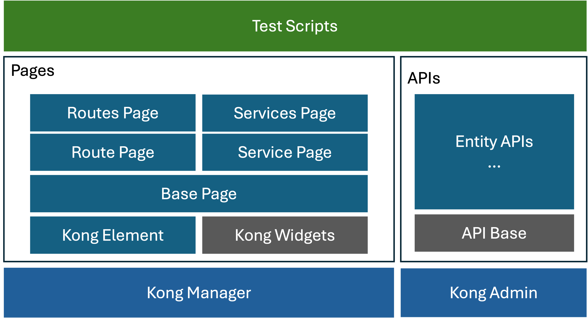

# kong-homework-cypress
Homework for kong test automation by cypress

## Test Cases
- 'route.cy.js' use API to create the service as data precodntion and create the route from the routes list and link this service
- 'service.cy.js' use UI to create the service from strach and add the route from the service directly.

## Execution
Please use Node.js 18.x, 20.x, 22.x and above and docker is required
- local
  ```
  git clone https://github.com/icelandld815/cypress-test.git
  docker-compose up -d
  npm install
  npm run test
  ```
- CI:  [E2E TEST Workflow](https://github.com/icelandld815/kong-homework-cypress/actions/workflows/main.yml)
- Report: use mochawesome

## Design
It aims to use the common page object design to interact with the page, each action support the data can be retived from outside file or as paramters.



### Kong Element
To enhance support for test automation, Kong Manager introduces the "data-testid" attribute as a standardized identifier for elements, aiding in easy element location during testing. By encapsulating the logic related to "data-testid" within a custom wrapper object named ke, several benefits can be achieved:
- Avoidance of 'data-testid' Dependency Everywher
- Seamless Transition to Other Test Automation Frameworks

### Base Page && Pages
The BasePage class serves as a foundational class for page objects, providing methods to access a page and load data for testing. Derived pages extend this base class, which can be divided into two sections: using constant variables to define page element locators and dealing with page interactions within the class.

### Service and utils
- API calls for data preparation in test automation can significantly speed up execution
- Usage of random IDs to ensure repeatability

### Furthers
- concurrent execution
- report merge & storage
- how to organize API and UI together
- Widget encapsulation 
